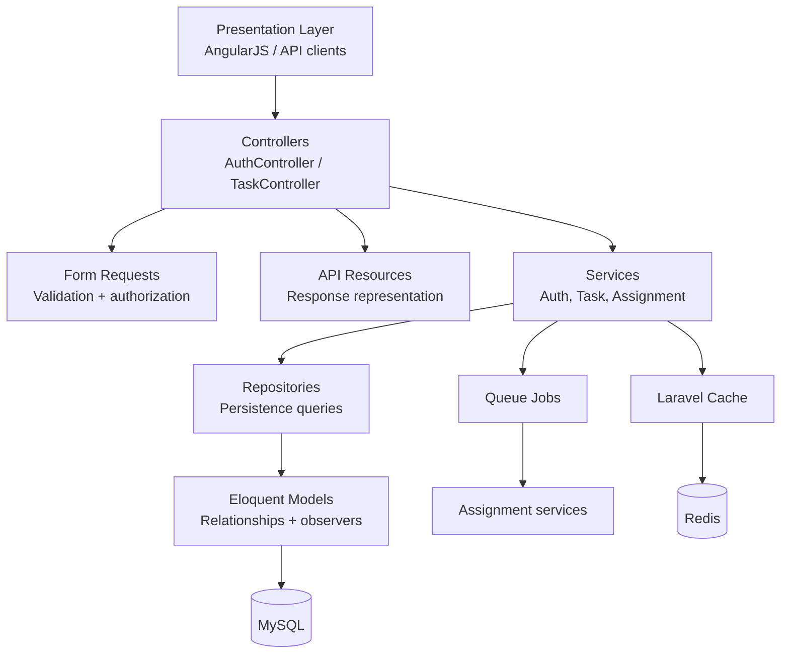
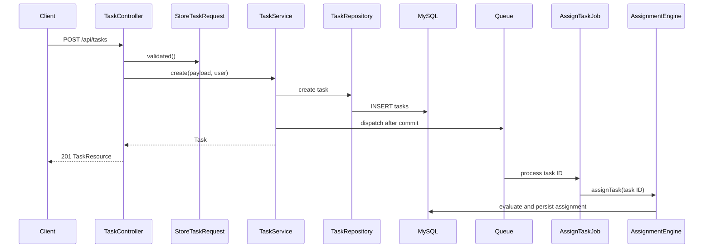
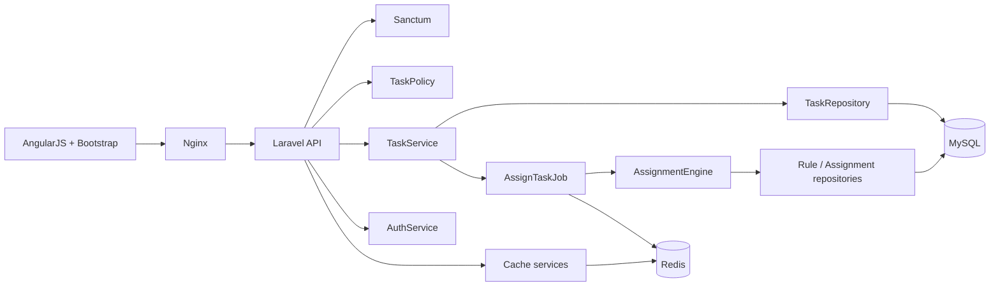

# Architecture

[Documentation index](README.md) · [Database](Database.md) · [API](API.md)

## Overview

The backend is a Laravel 11 API organised around clear responsibility boundaries. HTTP controllers are deliberately thin, while business workflows live in services and persistence access is centralised in repositories. Eloquent models provide domain relationships, Laravel policies govern task access, and jobs move assignment work off the request path.

## Layers

### Presentation layer

The AngularJS frontend stores a Sanctum bearer token locally and calls `/api`. Nginx serves the static frontend and sends API traffic to Laravel. Other clients consume the same REST endpoints.

### Controllers

`AuthController` delegates registration, login, logout, and current-user retrieval to `AuthService`. `TaskController` delegates task workflows to `TaskService`; it only maps requests, resources, policy checks, and standard API responses.

### Services

Services coordinate use cases, transactions, cache interactions, logs, and queue dispatch:

- `AuthService` handles credentials, tokens, and role-backed registration.
- `TaskService` creates, updates, deletes, and retrieves tasks; task creation dispatches assignment after commit.
- `AssignmentEngine`, `RuleEvaluator`, `UserEligibilityService`, `AssignmentSelector`, and `AssignmentLogger` implement the assignment workflow.
- Cache services encapsulate task, rule, profile, workload, and eligibility cache access.

### Repositories

Repositories provide query-focused persistence operations. `TaskRepository` owns task queries and eager loading; `UserRepository`, `AssignmentRuleRepository`, and `TaskAssignmentRepository` support authentication and assignment workflows. This keeps database-query details out of controllers and services.

### Models and database

Eloquent models define the domain graph: roles and users, task creators, assignment rules, task assignments, and immutable-style assignment-log records. Observers clear affected cache entries when models change. See [Database](Database.md).

## Dependency injection

Laravel's container injects contracts and collaborators into controllers, services, jobs, and policies. Services depend on repositories and focused collaborators instead of constructing them directly. This makes dependencies explicit and permits isolated tests with fakes or mocks.

## Repository pattern

The repository layer encapsulates query shape, including eager loading, pagination, filters, sorting, and locking reads. For example, task listing loads its creator in the query, while the assignment engine obtains a task under a transaction lock before creating an assignment.

## Service layer

The service layer contains business boundaries that are larger than a single database operation: a task write and cache lifecycle, or assignment rule loading plus eligibility evaluation, fair selection, record creation, and audit logging. Transactions are used around task changes and assignment creation where related mutations must remain consistent.

## SOLID principles in practice

| Principle | Application |
| --- | --- |
| Single responsibility | Requests validate, resources transform, repositories query, services orchestrate, policies authorize. |
| Open/closed | Rule evaluation and selection are separate collaborators, enabling additional conditions or strategies without rewriting the engine. |
| Liskov substitution | Laravel contracts and injected collaborators can be replaced by compatible test doubles. |
| Interface segregation | Components expose narrow use-case methods rather than a broad controller-facing data layer. |
| Dependency inversion | Controllers/jobs receive services through the container instead of creating infrastructure dependencies. |

## Request sequence

The following sequence shows task creation. Assignment runs only after the task transaction has committed.

## Component view

Next: [Database](Database.md) · [API](API.md) · [Rule Engine](RuleEngine.md)
