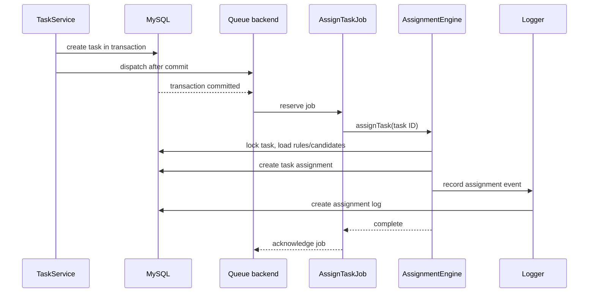

# Queue processing

[Documentation index](README.md) · [Rule Engine](RuleEngine.md) · [Deployment](Deployment.md)

## Overview

Queue processing removes assignment-rule evaluation from task creation requests. The application dispatches jobs directly from the task and rule workflows; it does not currently define separate Laravel event/listener classes for this flow.

## Jobs

| Job | Trigger | Work |
| --- | --- | --- |
| `AssignTaskJob` | A task is created | Calls `AssignmentEngine` to evaluate rules and create an assignment/log. |
| `RecomputeEligibilityJob` | Eligibility recomputation is requested for a rule | Resolves the rule and refreshes eligibility evaluation. |

Both jobs implement `ShouldQueue`.

## Assignment sequence



## Queue configuration

Laravel uses `QUEUE_CONNECTION`; the application can run with the `redis` or `database` driver. The repository's Docker environment configures Redis, while Laravel's configuration retains database-compatible defaults for other environments. Redis and database queue connections use a `retry_after` value of 150 seconds.

## Retry and timeout

Both assignment jobs define:

- `tries = 3`
- `timeout = 120` seconds
- `backoff = [10, 60, 300]` seconds

Operate a worker with compatible process settings:

```bash
php artisan queue:work --tries=3 --timeout=120
```

## Failed jobs and logging

Laravel's failed-job driver is configurable through `QUEUE_FAILED_DRIVER` and defaults to the database UUID driver. Each job implements `failed()` to emit structured logs:

- `queue.assignment_job_failed`
- `queue.recompute_eligibility_job_failed`

The engine also logs `assignment.started` and `assignment.completed`. Failures can be inspected with Laravel's failed-job commands when a failed-job driver is configured:

```bash
php artisan queue:failed
php artisan queue:retry all
```

## Operational notes

- Start at least one worker in every environment where assignments should occur.
- Ensure the worker's `--timeout` remains lower than the queue connection’s retry visibility period.
- Restart workers after deploying PHP code so they load the new application version.
- Monitor logs and failed jobs; neither a public queue-status endpoint nor a queue dashboard is implemented today.

Next: [Redis](Redis.md) · [Deployment](Deployment.md) · [Testing](Testing.md)
