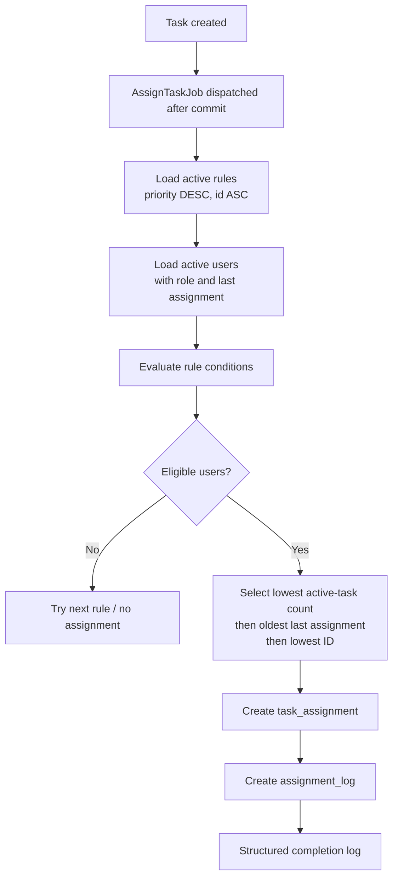

# Dynamic rule-based assignment engine

[Documentation index](README.md) · [Database](Database.md) · [Queue](Queue.md) · [Redis](Redis.md)

## Purpose

The assignment engine assigns a newly created task without adding assignment latency to the HTTP response. It loads active rules, evaluates each rule against active users, selects the fairest eligible candidate, persists the assignment, and records an audit log.

## Workflow

1. `TaskService` creates the task inside its write workflow and dispatches `AssignTaskJob` after the database commit.
2. The job calls `AssignmentEngine::assignTask()`.
3. The engine locks the task in a transaction and exits if it no longer exists or already has an assignment.
4. Active rules are loaded from the repository/cache in priority-descending, ID-ascending order.
5. `UserEligibilityService` obtains active users with their roles, cached workload counts, and their latest assignment timestamp.
6. `RuleEvaluator` filters candidates against a rule's JSON conditions.
7. `AssignmentSelector` ranks eligible users fairly.
8. The engine creates a `task_assignments` record; `AssignmentLogger` creates the corresponding `assignment_logs` record.
9. Cache observers invalidate affected workload, task, and eligible-user data.

## Rule evaluation

The evaluator supports these condition keys in the JSON `conditions` column:

| Condition | Behaviour |
| --- | --- |
| `user_ids` | Candidate ID must be listed. |
| `roles` or `role` | Candidate role name must match. |
| `departments` or `department` | Candidate department must match. |
| `designations` or `designation` | Candidate designation must match. |
| `max_active_tasks` | Candidate’s open assignment count cannot exceed the value. |

Every candidate must be active (`users.status = true`). Conditions combine as filters: a candidate must satisfy all supplied conditions. The `actions` JSON column is stored for rule modelling but is not evaluated by the current engine.

## Assignment strategy

The selector sorts eligible users by:

1. ascending active task count;
2. ascending last-assignment time (the least recently assigned user first);
3. ascending user ID as a deterministic tie-breaker.

This keeps work distributed without random selection and makes test results repeatable.

## No eligible user

If no user matches a rule, the engine continues to the next active rule. If no rule produces candidates, it returns without creating a task assignment or assignment log. The task remains available for later handling; no public assignment endpoint currently exists.

## Multiple eligible users

When multiple candidates match, the ranking strategy above chooses one. The task/assignment query runs within a transaction and the task is locked before assignment, which prevents duplicate concurrent assignment creation for the same task.

## Retry and failure handling

`AssignTaskJob` has three attempts, a 120-second timeout, and backoff intervals of 10, 60, and 300 seconds. If an attempt ultimately fails, its `failed()` hook writes a structured queue-failure log and Laravel records it through the configured failed-job driver. See [Queue](Queue.md).

## Eligibility recomputation

`RecomputeEligibilityJob` resolves an assignment rule and runs eligibility evaluation. Rule observers invalidate cached eligible-user results when a rule changes; this job provides asynchronous recomputation support.

## Future rule builder

A future administrative interface can safely build on the JSON condition model by validating supported keys, previewing eligible users, versioning rule changes, and exposing rule CRUD through authorized API endpoints. That API/UI is not part of the currently implemented routes.

Next: [Queue](Queue.md) · [Redis](Redis.md) · [Database](Database.md)
